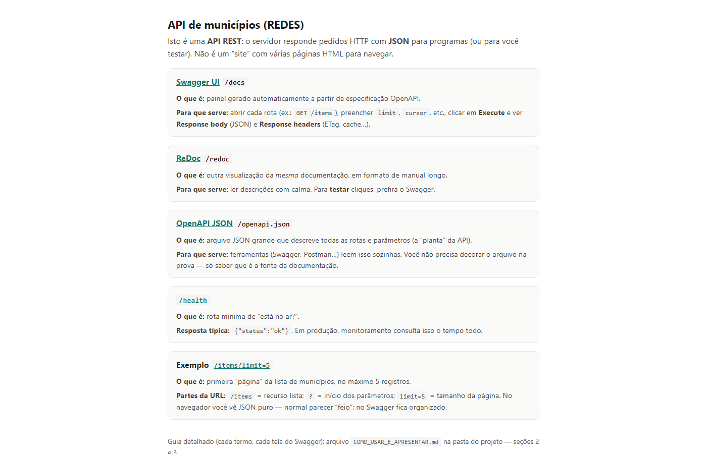
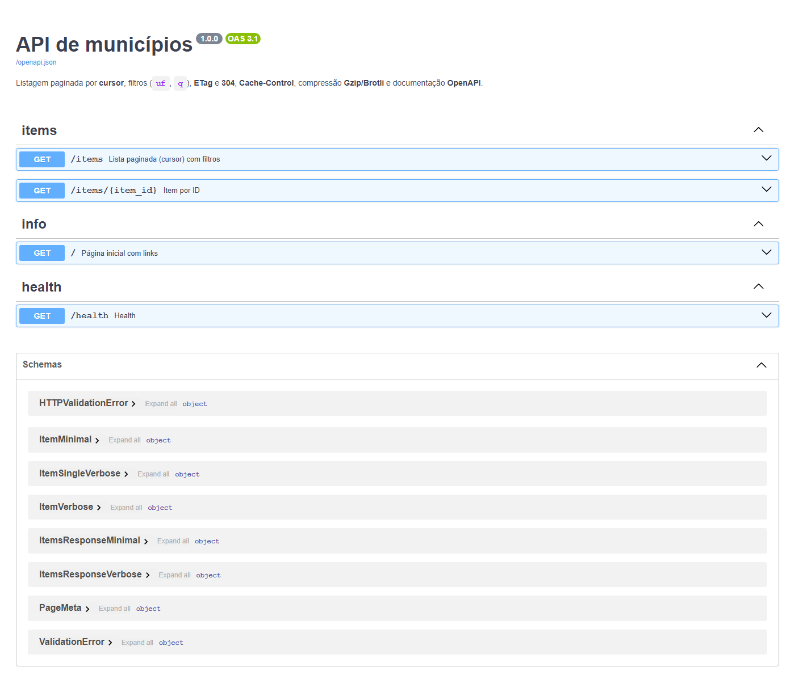
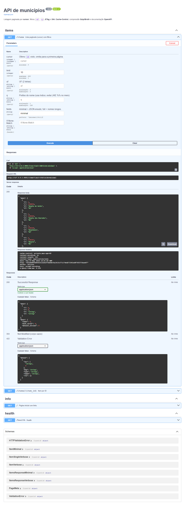
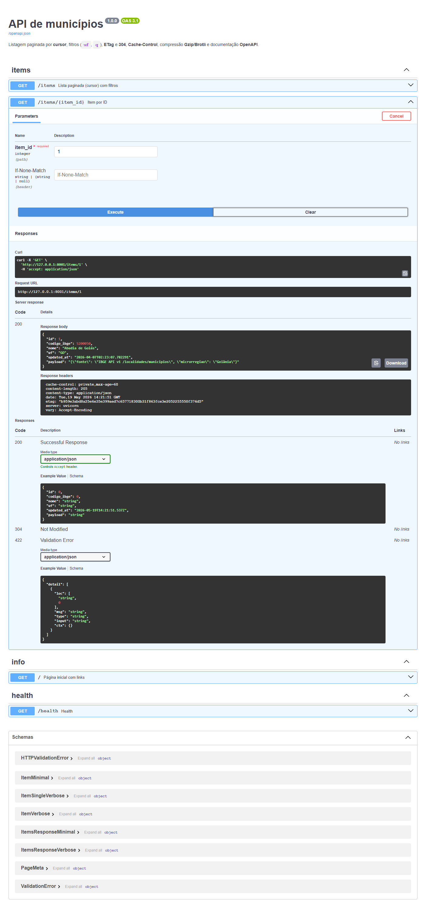
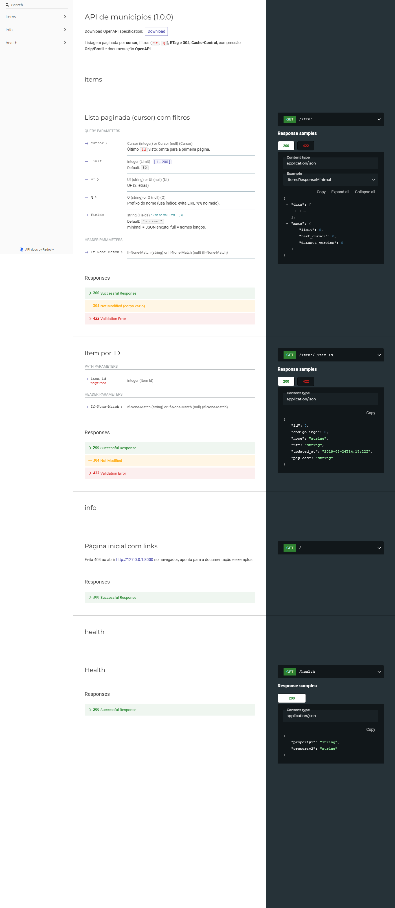
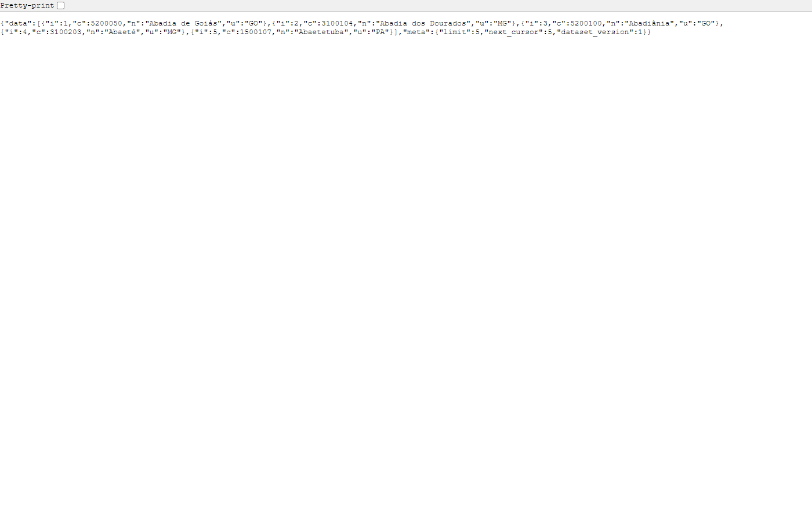
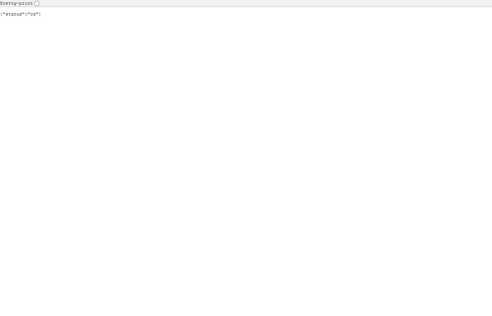
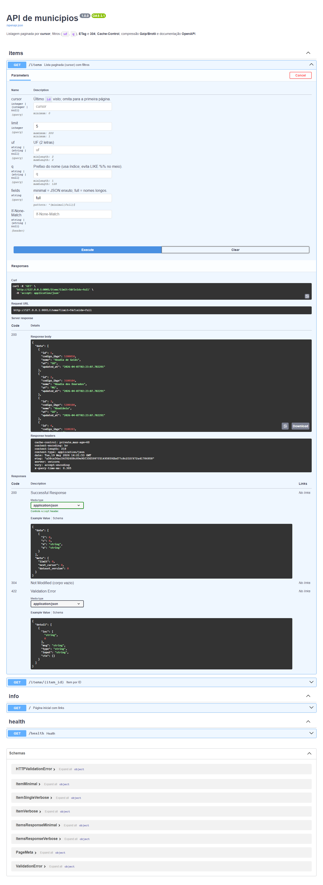
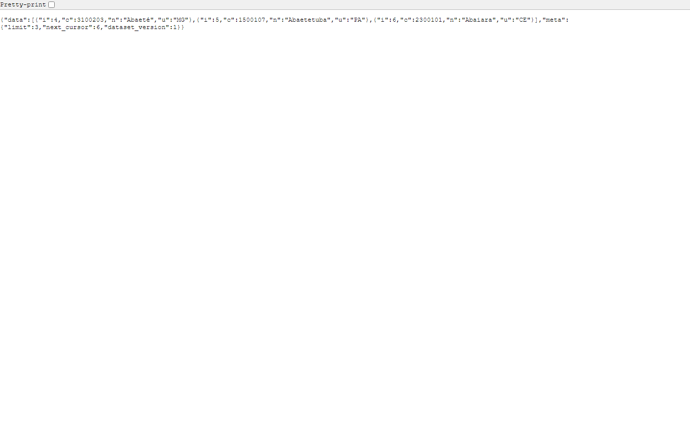
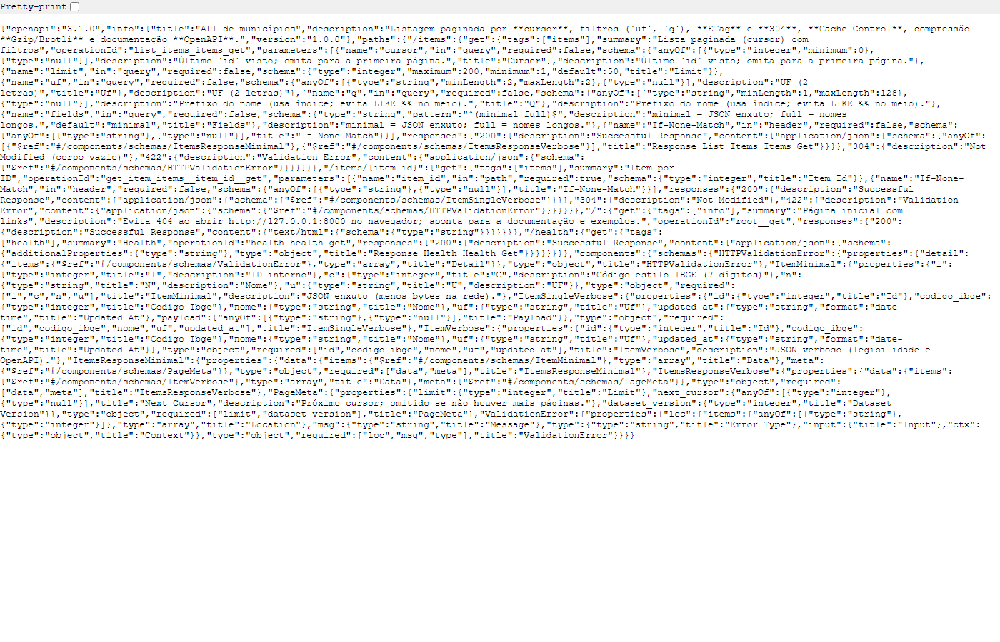

<div align="center">


<br />

**API REST de municípios (IBGE)** · paginação por cursor, ETag, cache e compressão · disciplina **REDES** · TADS UCDB

<br />

[](https://fastapi.tiangolo.com/)
[](https://www.python.org/)
[](https://www.sqlite.org/)
[](https://www.openapis.org/)

<br />

[Tour da interface](#tour-pela-interface) ·
[Galeria](#galeria-completa) ·
[Como executar](#como-executar) ·
[API](#api) ·
[Documentação](#documentação)

</div>

---

## Sobre o projeto

Esta API expõe **municípios brasileiros** (dados oficiais do IBGE ou base sintética para testes de volume) com foco em **boas práticas REST/HTTP**: paginação estável por **cursor**, filtros, **JSON enxuto ou completo**, cabeçalhos **ETag** e **304 Not Modified**, **Cache-Control** e compressão **Gzip/Brotli**.

> Projeto acadêmico para estudo de redes e otimização de APIs. Não é um serviço oficial do IBGE.

### Funcionalidades principais

| Recurso | Descrição |
|--------|-----------|
| **Paginação por cursor** | `GET /items?limit=50&cursor=<id>` com `meta.next_cursor` |
| **Filtros** | `uf` (2 letras) e `q` (prefixo do nome) |
| **Campos** | `fields=minimal` (padrão) ou `fields=full` |
| **Cache condicional** | `If-None-Match` + **ETag** → **304** sem reenviar o corpo |
| **Compressão** | `Accept-Encoding: gzip` ou `br` (Brotli) |
| **Benchmark OFFSET** | `ENABLE_BENCHMARKS=1` e rota de comparação (opcional) |

**Guia detalhado para apresentação:** [COMO_USAR_E_APRESENTAR.md](COMO_USAR_E_APRESENTAR.md)

---

## Tour pela interface

A aplicação é uma **API REST** (respostas em JSON). A demonstração visual usa a **página inicial**, o **Swagger** (`/docs`), o **ReDoc** e exemplos de resposta no navegador.

---

### 1. Página inicial



Índice HTML em `/` com links para Swagger, ReDoc, OpenAPI, health e exemplo `GET /items`. Evita 404 ao abrir o endereço raiz e orienta onde testar cada recurso.

---

### 2. Swagger — visão geral



Documentação interativa gerada pelo FastAPI. Agrupa rotas `items`, `health` e `info`; ideal para **executar** requisições na aula ou na banca.

---

### 3. Swagger — listar municípios



`GET /items` executado com `limit=10`. Mostra o corpo JSON paginado, cabeçalhos (`ETag`, `Cache-Control`, `X-Query-Time-Ms`) e o fluxo **Try it out → Execute**.

---

### 4. Swagger — filtro por UF


Mesma rota com `uf=MS` e `limit=15`. Demonstra filtro por estado sem varrer toda a base no cliente.

---

### 5. Swagger — item por ID



`GET /items/{item_id}` para um registro completo, incluindo `payload` e suporte a **304** via `If-None-Match`.

---

### 6. ReDoc



Manual longo da mesma especificação OpenAPI — útil para **ler** parâmetros e esquemas com calma.

---

### 7. JSON no navegador — primeira página



`GET /items?limit=5` aberto diretamente no navegador: resposta JSON “crua” com `data` e `meta.next_cursor`.

---

### 8. Health check



`GET /health` retorna `{"status":"ok"}` — padrão para monitoramento de disponibilidade.

---

### 9. Swagger — campos completos



`fields=full` na listagem: nomes de propriedades legíveis e mais colunas por item (comparar com `minimal`).

---

### 10. Paginação por cursor



Segunda página usando `cursor` devolvido em `meta.next_cursor` — paginação estável sem `OFFSET` alto.

---

### 11. OpenAPI JSON



Especificação em `/openapi.json`: fonte usada pelo Swagger e ReDoc para montar a documentação.

---

## Galeria completa

Todas as capturas, em ordem, para consulta rápida ou uso em slides.

<table>
  <tr>
    <td align="center" width="33%">
      <a href="docs/screenshots/01-pagina-inicial.png"></a><br/>
      <sub><b>01</b> · Página inicial</sub>
    </td>
    <td align="center" width="33%">
      <a href="docs/screenshots/02-swagger-visao-geral.png"></a><br/>
      <sub><b>02</b> · Swagger</sub>
    </td>
    <td align="center" width="33%">
      <a href="docs/screenshots/03-swagger-listar-items.png"></a><br/>
      <sub><b>03</b> · Listar items</sub>
    </td>
  </tr>
  <tr>
    <td align="center">
      <a href="docs/screenshots/04-swagger-filtro-uf.png"></a><br/>
      <sub><b>04</b> · Filtro UF</sub>
    </td>
    <td align="center">
      <a href="docs/screenshots/05-swagger-item-por-id.png"></a><br/>
      <sub><b>05</b> · Item por ID</sub>
    </td>
    <td align="center">
      <a href="docs/screenshots/06-redoc.png"></a><br/>
      <sub><b>06</b> · ReDoc</sub>
    </td>
  </tr>
  <tr>
    <td align="center">
      <a href="docs/screenshots/07-items-json-limit5.png"></a><br/>
      <sub><b>07</b> · JSON limit 5</sub>
    </td>
    <td align="center">
      <a href="docs/screenshots/08-health.png"></a><br/>
      <sub><b>08</b> · Health</sub>
    </td>
    <td align="center">
      <a href="docs/screenshots/09-swagger-campos-full.png"></a><br/>
      <sub><b>09</b> · fields=full</sub>
    </td>
  </tr>
  <tr>
    <td align="center">
      <a href="docs/screenshots/10-paginacao-cursor.png"></a><br/>
      <sub><b>10</b> · Cursor</sub>
    </td>
    <td align="center" colspan="2">
      <a href="docs/screenshots/11-openapi-json.png"></a><br/>
      <sub><b>11</b> · OpenAPI JSON</sub>
    </td>
  </tr>
</table>

> Clique em qualquer imagem para abrir em tamanho original. Arquivos em [`docs/screenshots/`](docs/screenshots/).

---

## Stack

| Camada | Tecnologias |
|--------|-------------|
| **API** | Python 3.11+ · FastAPI · Uvicorn |
| **Dados** | SQLAlchemy · SQLite |
| **HTTP** | ETag / 304 · Cache-Control · Gzip · Brotli |
| **Testes** | pytest · httpx (TestClient) |
| **Docs** | OpenAPI 3.1 · Swagger UI · ReDoc |

---

## Como executar

### Pré-requisitos

- [Python 3.11+](https://www.python.org/) no PATH (ou launcher `py`)
- Opcional: Node.js (apenas para regenerar screenshots com `npm run screenshots`)

### Opção 1 — Atalho Windows (recomendado)

Duplo clique em **`iniciar-api.bat`** na raiz do projeto.

O script detecta Python 3.10+ no PC, cria ou **repara** `.venv` (se veio de outro computador), instala dependências, gera `data\ibge_api.db` sintético (3 000 registros) se o banco não existir e sobe a API.

| Atalho | Função |
|--------|--------|
| `iniciar-api.bat` | Sobe a API e abre o Swagger |
| `instalar-dependencias.bat` | Recria `.venv` do zero (útil ao copiar o projeto) |
| `carregar-dados-ibge.bat` | Carga oficial IBGE (internet) |
| `testar-api.bat` | Executa `pytest` |

| URL | Conteúdo |
|-----|----------|
| http://127.0.0.1:8000 | Página inicial com links |
| http://127.0.0.1:8000/docs | Swagger UI |
| http://127.0.0.1:8000/redoc | ReDoc |
| http://127.0.0.1:8000/items?limit=5 | Exemplo JSON |

### Opção 2 — Clone e linha de comando

```powershell
git clone https://github.com/FenixMaker/api-municipios-redes.git
cd api-municipios-redes
python -m venv .venv
.\.venv\Scripts\Activate.ps1
pip install -r requirements.txt
python scripts\seed_db.py --count 3000
python -m uvicorn app.main:app --reload --host 127.0.0.1 --port 8000
```

<details>
<summary><b>Carga de dados</b></summary>

<br/>

**IBGE (oficial, requer internet):**

```powershell
python scripts\load_ibge_municipios.py
```

**Sintético (volume / benchmark):**

```powershell
python scripts\seed_db.py --count 4000000
```

</details>

<details>
<summary><b>Testes e medições</b></summary>

<br/>

```powershell
.\testar-api.bat
# ou
pytest tests\ -v
```

Medições de compressão e OFFSET vs cursor: [docs/METRICAS.md](docs/METRICAS.md).

</details>

---

## Contas de demonstração

Esta API **não possui login nem JWT**. Todos os endpoints públicos listados na documentação podem ser testados diretamente no Swagger ou com `curl`.

Para comparar com um projeto full stack com autenticação, veja o [EquipFlow (DAC 2026)](https://github.com/FenixMaker/equipflow-dac-2026).

---

## API

| Rota | Descrição |
|------|-----------|
| `GET /` | Página HTML com links úteis |
| `GET /health` | Status `ok` |
| `GET /items` | Lista paginada (`cursor`, `limit`, `uf`, `q`, `fields`) |
| `GET /items/{item_id}` | Detalhe de um município |
| `GET /items/debug/offset-page` | Benchmark OFFSET (com `ENABLE_BENCHMARKS=1`) |
| `GET /openapi.json` | Especificação OpenAPI |

Documentação interativa: **http://127.0.0.1:8000/docs**

---

## Documentação

| Arquivo | Descrição |
|---------|-----------|
| [COMO_USAR_E_APRESENTAR.md](COMO_USAR_E_APRESENTAR.md) | Roteiro de apresentação (Swagger, ETag, 304) |
| [docs/METRICAS.md](docs/METRICAS.md) | Medições e benchmarks |
| [docs/artigo.tex](docs/artigo.tex) | Artigo em LaTeX |
| [presentation/SLIDES.md](presentation/SLIDES.md) | Roteiro de slides |
| [docs/screenshots/](docs/screenshots/) | Capturas de tela |

**Regenerar screenshots** (API deve estar rodando, padrão porta 8001 se 8000 estiver ocupada):

```powershell
npm install
$env:API_BASE="http://127.0.0.1:8000"; npm run screenshots
```

---

## Estrutura do repositório

```
api-municipios-redes/
├── app/                    # API FastAPI (rotas, modelos, ETag)
│   ├── routers/
│   ├── services/
│   └── main.py
├── docs/
│   ├── brand/              # Logo SVG
│   ├── screenshots/        # Capturas para README
│   └── METRICAS.md
├── scripts/                # Carga IBGE, seed, captura de telas
├── tests/
├── data/                   # SQLite (gerado localmente, não versionado)
├── presentation/
├── iniciar-api.bat
├── instalar-dependencias.bat
├── carregar-dados-ibge.bat
├── testar-api.bat
├── _portable-init.bat
├── _venv-setup.bat
└── requirements.txt
```

---

<div align="center">

**API Municípios REDES** · TADS · UCDB

*Projeto acadêmico — dados IBGE ou sintéticos para estudo de APIs*

</div>
